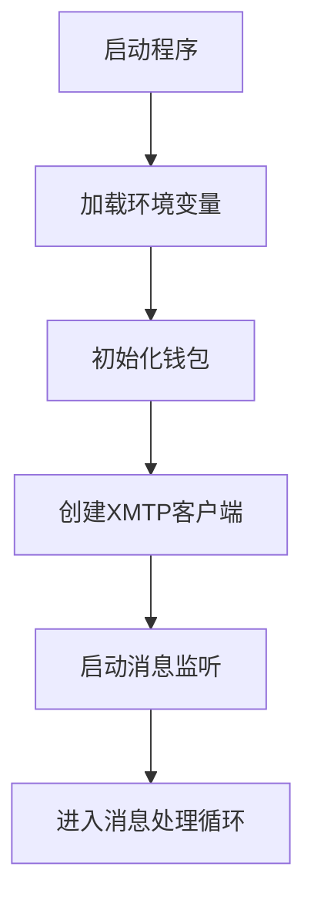
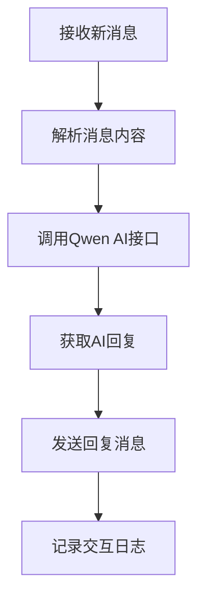

# XMTP + Qwen AI Chatbot - 架构设计文档

## 系统架构概述

本系统采用模块化设计，包含以下几个核心模块：
1. XMTP通信模块 - 负责与XMTP网络的交互
2. Qwen AI接口模块 - 负责与Qwen AI API的交互
3. 钱包管理模块 - 负责机器人钱包的生成和管理
4. 主控制模块 - 协调各模块工作并处理消息流

## 模块详细设计

### 1. 主控制模块 (index.js)

#### 职责
- 系统初始化
- 协调各模块工作
- 处理消息流循环

#### 主要功能
```javascript
// 初始化系统
async function initializeSystem() {
  // 加载环境变量
  // 初始化钱包
  // 创建XMTP客户端
}

// 消息处理循环
async function handleMessageStream(xmtpClient) {
  // 监听消息流
  // 处理新消息
  // 调用AI接口
  // 发送回复
}

// 主函数
async function main() {
  // 初始化系统
  // 启动消息处理循环
}
```

### 2. XMTP通信模块

#### 职责
- 创建和管理XMTP客户端
- 处理消息的接收和发送
- 管理会话和对话

#### 主要功能
```javascript
// 创建XMTP客户端
async function createXMTPClient(wallet) {
  // 使用钱包创建XMTP客户端
  // 配置网络环境
}

// 监听消息流
async function listenForMessages(xmtpClient) {
  // 创建消息流监听器
  // 处理新对话
  // 处理新消息
}

// 发送消息
async function sendMessage(conversation, message) {
  // 发送消息到指定对话
}
```

### 3. Qwen AI接口模块

#### 职责
- 调用Qwen AI API
- 处理API响应
- 处理错误情况

#### 主要功能
```javascript
// 调用Qwen AI API
async function getAIResponse(message) {
  // 构造API请求
  // 发送请求
  // 处理响应
  // 返回AI回复
}

// 处理错误
function handleAPIError(error) {
  // 记录错误日志
  // 返回错误信息
}
```

### 4. 钱包管理模块

#### 职责
- 生成和管理机器人钱包
- 持久化钱包信息
- 提供钱包访问接口

#### 主要功能
```javascript
// 获取机器人钱包
function getBotWallet() {
  // 检查是否存在钱包文件
  // 如果存在则加载钱包
  // 如果不存在则创建新钱包
  // 保存钱包到文件
}

// 保存钱包
function saveWallet(wallet, filename) {
  // 将钱包信息保存到文件
}

// 加载钱包
function loadWallet(filename) {
  // 从文件加载钱包信息
}
```

## 数据流设计

### 1. 系统启动流程



### 2. 消息处理流程



## 错误处理设计

### 1. XMTP连接错误
- 重试机制
- 降级到本地测试模式
- 记录错误日志

### 2. API调用错误
- 网络超时处理
- API限流处理
- 错误信息返回给用户

### 3. 消息处理错误
- 消息解析失败处理
- 回复发送失败处理
- 异常情况日志记录

## 安全设计

### 1. 密钥管理
- 使用dotenv管理环境变量
- 钱包私钥加密存储
- API密钥安全传输

### 2. 通信安全
- XMTP协议端到端加密
- HTTPS API调用
- 消息完整性验证

### 3. 访问控制
- 消息发送者身份验证
- 基本的垃圾消息防护
- 速率限制

## 性能优化

### 1. 资源管理
- 连接池管理
- 内存使用优化
- 缓存机制

### 2. 响应时间优化
- 异步处理
- 并发控制
- 超时设置

## 部署架构

### 1. 本地开发环境
- Node.js开发服务器
- 本地钱包文件存储
- 控制台日志输出

### 2. 生产环境部署
- 云服务器部署
- 进程管理(如PM2)
- 日志文件存储
- 监控和告警

## 扩展性设计

### 1. 插件系统
- 模块化接口设计
- 动态加载机制
- 配置文件管理

### 2. 多机器人支持
- 多钱包管理
- 多XMTP客户端
- 负载均衡

### 3. 多语言支持
- 国际化消息处理
- 语言检测
- 多语言回复

## 测试策略

### 1. 单元测试
- 各模块独立测试
- API接口模拟
- 错误路径测试

### 2. 集成测试
- XMTP通信测试
- AI接口集成测试
- 端到端流程测试

### 3. 性能测试
- 响应时间测试
- 并发处理测试
- 资源使用监控

## 监控和维护

### 1. 系统监控
- 运行状态监控
- 性能指标收集
- 错误日志分析

### 2. 维护计划
- 定期更新依赖
- 安全补丁应用
- 性能优化调整

## 未来发展方向

### 1. 功能扩展
- 群聊支持
- 多媒体消息处理
- 智能回复优化

### 2. 技术升级
- XMTP协议升级支持
- AI模型升级
- 性能优化

### 3. 生态集成
- 与其他去中心化协议集成
- 第三方服务集成
- 开发者工具支持