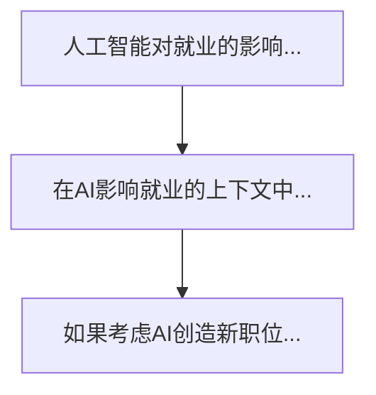

# 多轮对话工具

基于prompt.txt需求开发的多轮对话工具，支持NER、RE和递归分析。

## 更新说明

- ✅ 已将OpenAI和Mistral的调用方式从HTTP REST改为官方SDK
- ✅ 已将豆包API和Kimi API的调用方式从HTTP REST改为OpenAI SDK兼容方式

## 功能特点

- ✅ 四步对话分析流程
- ✅ 火山引擎豆包NER/RE功能
- ✅ Mistral三元组稳定性分析
- ✅ 问题树可视化（Mermaid）
- ✅ 递归深入探讨机制
- ✅ 唯一编号系统
- ✅ 实时问题树打印（printCurrentTree）

## 安装

```bash
npm install
```

## 使用方法

```bash
npm start
```

## 使用流程

1. **输入API密钥**：OpenAI、火山引擎豆包、Mistral
2. **输入system提示词**：设置对话上下文
3. **输入问题**：启动第一轮分析
4. **查看报告**：系统生成综合分析报告
5. **选择深入**：对不稳定关系进行递归分析
6. **完成分析**：查看问题树和mermaid图

## 问题编号系统

- root-001：根问题
- level1-001：第一级分支
- level2-001：第二级分支
- 依此类推...

## 输出文件

- `analysis-[timestamp].json`：完整分析结果
- 包含问题树和Mermaid可视化

## 项目结构

```
src/
├── DialogueManager.js      # 主对话管理器
├── OpenAIClient.js         # OpenAI客户端
├── DoubaoClient.js         # 豆包客户端
├── MistralClient.js        # Mistral客户端
├── Step1Processor.js       # 步骤1处理器
├── Step2Processor.js       # 步骤2处理器
├── Step3Processor.js       # 步骤3处理器
├── Step4Processor.js       # 步骤4处理器
├── RecursiveProcessor.js   # 递归处理器
└── QuestionTree.js         # 问题树管理（包含printCurrentTree方法）
```

## 示例Mermaid输出

